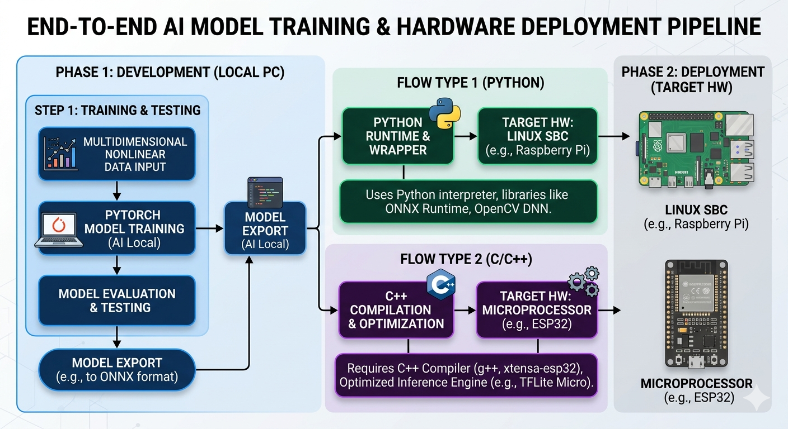
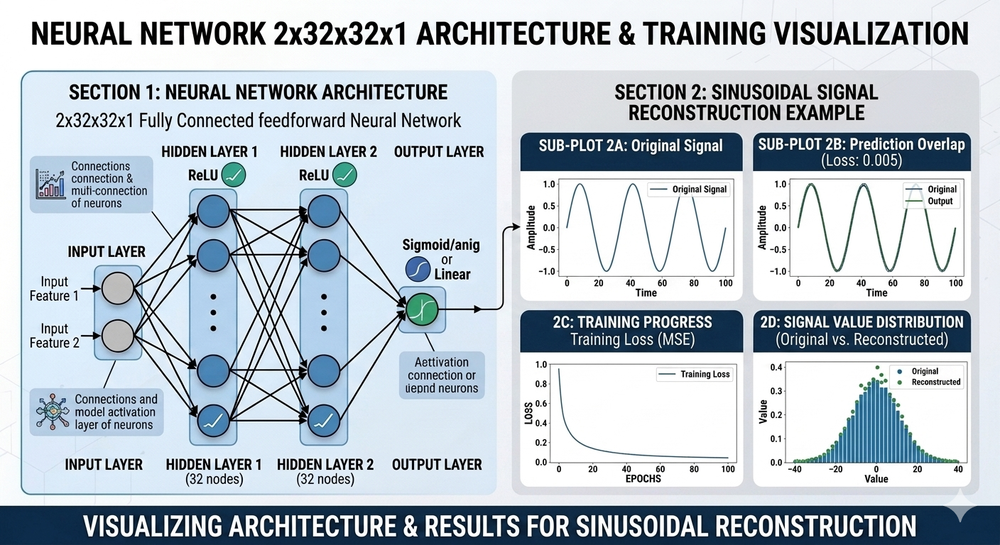
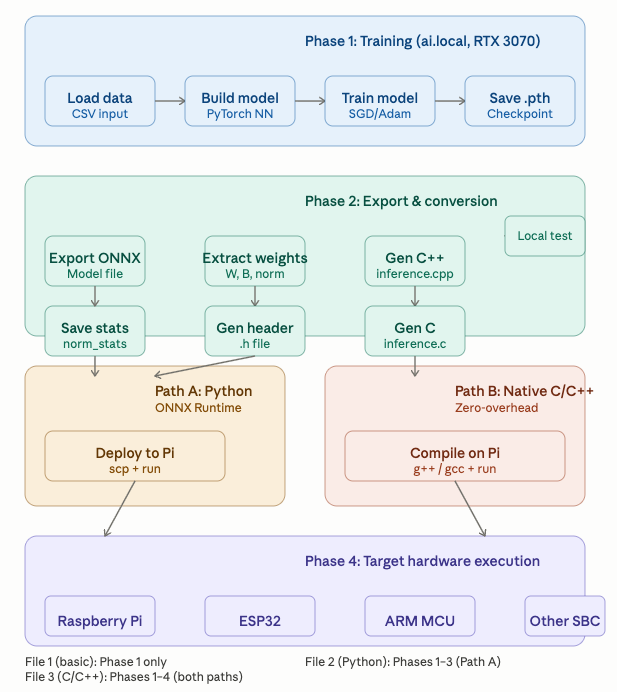

# PyTorch ML Training & Embedded Inference Pipeline

Train deep learning models on GPU, export to ONNX or native C/C++, 
deploy to Raspberry Pi, ESP32, and ARM microcontrollers 
with zero-overhead inference.





## 🎯 Quick Start

Three self-contained Python files demonstrating ML inference at different levels:

1. **[`1pytorch.py`](#file-1-basic-pytorch-training)** — Learn PyTorch fundamentals
2. **[`2pytorch_non_linear.py`](#file-2-python-onnx-pipeline)** — Train & deploy via ONNX Runtime
3. **[`3train_export_deploy_cpp.py`](#file-3-native-cc-pipeline)** — Train & deploy compiled C/C++ code

All files train on **ai.local (RTX 3070 8GB)** and deploy to **Raspberry Pi**, **ESP32**, and **ARM microcontrollers**.

---

## 📋 Project Files

### Python Training Scripts

| File | Purpose | Model | Export | Target |
|------|---------|-------|--------|--------|
| **[1pytorch.py](./1pytorch.py)** | Learn PyTorch basics | Linear (2→1) | None | Development |
| **[2pytorch_non_linear.py](./2pytorch_non_linear.py)** | Full Python pipeline | Nonlinear (2→32→32→1) | ONNX | Python on Pi |
| **[3train_export_deploy_cpp.py](./3train_export_deploy_cpp.py)** | Complete C/C++ pipeline | Nonlinear (2→32→32→1) | C/C++ headers | Any (ARM/x86) |

### Documentation

| Document | Format | Contents |
|----------|--------|----------|
| **[ml_deployment_guide.html](./ml_deployment_guide.html)** | Interactive HTML | Detailed walkthroughs, code examples, performance notes |
| **[ML_DEPLOYMENT_QUICK_REF.md](./ML_DEPLOYMENT_QUICK_REF.md)** | Markdown | Quick reference, comparison tables, troubleshooting |
| **[README.md](./README.md)** | Markdown | This file |

---


---

## 🚀 Getting Started

### Prerequisites

- **Development machine:** Ubuntu 20.04+ or macOS, Python 3.8+
- **GPU:** NVIDIA GPU with CUDA support (RTX 3070 8GB recommended for training)
- **Target device:** Raspberry Pi 4/Zero 2W, or any ARM/x86 system with C compiler
- **Tools:** `sshpass` (for auto-deployment), SSH access to target

### Installation

1. **Clone or download** this repository

2. **Create Python environment:**
   ```bash
   python3 -m venv ml-env
   source ml-env/bin/activate  # Linux/macOS
   # or: ml-env\Scripts\activate  (Windows)
   ```

3. **Install dependencies:**
   ```bash
   pip install torch torchvision torchaudio --index-url https://download.pytorch.org/whl/cu118
   pip install pandas numpy onnx onnxruntime
   ```

4. **On target device (Raspberry Pi):**
   ```bash
   sudo apt-get update
   sudo apt-get install build-essential python3-pip
   pip install onnxruntime numpy pandas  # For File 2
   # No dependencies needed for File 3
   ```

---

## 📖 File-by-File Guide

### File 1: Basic PyTorch Training

**[`1pytorch.py`](./1pytorch.py)** — The simplest file, great for learning PyTorch fundamentals.

```bash
python 1pytorch.py
```

**What it does:**
- Creates synthetic CSV data: `y = 2*x1 + 3*x2`
- Trains a linear model (1 layer, 2→1) for 3000 epochs
- Saves checkpoint to `py_torch_model.pth`
- Tests predictions on new inputs
- Prints GPU availability

**Key concepts:**
- `nn.Module` and `nn.Linear` layers
- Forward pass, loss computation, backward pass
- Optimizer (`optim.SGD`)
- Saving/loading model state

**Output:**
- `py_torch_model.pth` — Trained model weights

**When to use:**
- Learning PyTorch basics
- Understanding training loops
- As a template for custom models

**Read the guide:** [HTML](./ml_deployment_guide.html#file1) | [Markdown](./ML_DEPLOYMENT_QUICK_REF.md#file-1-basic-pytorch-training)

---

### File 2: Python ONNX Pipeline

**[`2pytorch_non_linear.py`](./2pytorch_non_linear.py)** — Complete workflow: train → export ONNX → deploy Python script to Raspberry Pi.

```bash
python 2pytorch_non_linear.py
```

**What it does:**
1. Loads `simple_nonlinear.csv` (or creates synthetic data)
2. Trains a **nonlinear model** (3 layers with ReLU) using Adam optimizer
3. Saves normalization statistics (`norm_stats.npz`)
4. **Exports to ONNX format** (`nonlinear_model.onnx`)
5. Verifies ONNX predictions match PyTorch
6. Generates minimal Pi inference script (`ml_onnx_minimal_for_pi.py`)
7. **Auto-deploys to Pi** via `sshpass` (requires SSH access)

**Model architecture:**
```
Input (2) → Dense(32) + ReLU → Dense(32) + ReLU → Dense(1) → Output
```

**Outputs:**
- `nonlinear_model.onnx` — ONNX model (~50 KB)
- `norm_stats.npz` — Input normalization constants
- `ml_onnx_minimal_for_pi.py` — Minimal inference script for Pi
- Auto-copied to `pi@raspi.local:~/`

**On Raspberry Pi:**
```bash
python ml_onnx_minimal_for_pi.py
# Output: Prediction: 0.4567
```

**Performance:**
- Inference latency: **~0.1–1 ms** per prediction
- Training time: ~2–5 sec (1000 epochs)
- Binary footprint: ~50 KB (ONNX model)

**Features:**
- ✅ Auto-deployment via sshpass
- ✅ History feedback loop (feed output back as input)
- ✅ Batch predictions from CSV
- ✅ ONNX verification against PyTorch

**Dependencies on target:**
- Python 3.8+
- `onnxruntime`
- `numpy`
- `pandas`

**Read the guide:** [HTML](./ml_deployment_guide.html#file2) | [Markdown](./ML_DEPLOYMENT_QUICK_REF.md#file-2-python-onnx-pipeline)

---

### File 3: Native C/C++ Pipeline

**[`3train_export_deploy_cpp.py`](./3train_export_deploy_cpp.py)** — Complete pipeline: train → export C/C++ headers → compile → auto-deploy and test on Pi.

```bash
python 3train_export_deploy_cpp.py
```

**What it does:**
1. Loads data and trains **same nonlinear model** as File 2
2. Exports weights to **C header file** (`model_weights.h`) with static float arrays
3. Generates **C++ inference code** (`inference.cpp`)
4. Generates **C inference code** (`inference.c`)
5. Tests locally (`g++ -O2`)
6. **Auto-deploys to Pi** via `sshpass`
7. **Auto-compiles on Pi** and runs tests

**Generated files:**

| File | Purpose | Size |
|------|---------|------|
| `model_weights.h` | All weights as static arrays | ~40 KB |
| `inference.cpp` | C++ source with matrix math | ~4 KB |
| `inference.c` | C source (same logic) | ~4 KB |
| `inference_cpp` | Compiled executable (C++) | ~50 KB |
| `inference_c` | Compiled executable (C) | ~45 KB |

**Core inference function (generated C):**
```c
float predict(float x1, float x2) {
    // Normalize input
    float x[2] = {
        (x1 - MEAN[0]) / STD[0],
        (x2 - MEAN[1]) / STD[1]
    };
    
    // Forward through 3 layers
    float h1[32], h2[32], out[1];
    linear_relu(W1, B1, x, h1, 32, 2);
    linear_relu(W2, B2, h1, h2, 32, 32);
    linear(W3, B3, h2, out, 1, 32);
    
    return out[0];
}
```

**Compilation on Pi:**
```bash
# C++
g++ -O2 -o inference_cpp inference.cpp
./inference_cpp

# C (with math library)
gcc -O2 -o inference_c inference.c -lm
./inference_c
```

**Performance:**
- Inference latency: **~1–2 µs** per prediction (100× faster than ONNX)
- Training time: ~2–5 sec (1000 epochs)
- Binary footprint: ~45–50 KB (executable)

**Features:**
- ✅ Zero-overhead inference (no framework)
- ✅ Compile-time constants (weights baked into binary)
- ✅ Auto-deploy & auto-compile on Pi
- ✅ History feedback loop
- ✅ Works on any platform with C/C++ compiler

**Dependencies on target:**
- None (just C stdlib)

**Using in embedded project (ESP32, STM32):**
```c
#include "model_weights.h"
#include "inference.c"

float result = predict(5.0f, 5.0f);
Serial.println(result);
```

**Read the guide:** [HTML](./ml_deployment_guide.html#file3) | [Markdown](./ML_DEPLOYMENT_QUICK_REF.md#file-3-cc-native-pipeline)

---

## 🔗 Documentation

### Primary Guide
- **[ml_deployment_guide.html](./ml_deployment_guide.html)** — Interactive HTML guide
  - Detailed walkthroughs for all three files
  - Code examples and performance notes
  - Deployment step-by-step instructions
  - Open in browser, click tabs to navigate

### Quick Reference
- **[ML_DEPLOYMENT_QUICK_REF.md](./ML_DEPLOYMENT_QUICK_REF.md)** — Markdown quick reference
  - File summaries and comparisons
  - Workflow diagrams
  - Troubleshooting tips
  - Performance metrics

---

## 🛠️ Deployment Checklist

### Path A: Python ONNX (File 2)

- [ ] Raspberry Pi accessible via SSH (`raspi.local`)
- [ ] `sshpass` installed on dev machine
- [ ] Python 3.8+ on Pi
- [ ] `pip install onnxruntime numpy pandas` on Pi
- [ ] Run `python 2pytorch_non_linear.py`
- [ ] Verify files copied to Pi
- [ ] SSH to Pi and run `python ml_onnx_minimal_for_pi.py`

### Path B: Native C/C++ (File 3)

- [ ] Raspberry Pi accessible via SSH (`raspi.local`)
- [ ] `sshpass` installed on dev machine
- [ ] Build tools on Pi: `sudo apt-get install build-essential`
- [ ] Run `python 3train_export_deploy_cpp.py`
- [ ] Script auto-deploys, compiles, and tests on Pi

---

## 📊 Project Statistics

| Metric | Value |
|--------|-------|
| Python files | 3 |
| Documentation pages | 2 (HTML + Markdown) |
| Model architectures | 2 (linear, nonlinear) |
| Deployment targets | 3+ (Pi, ESP32, ARM MCU) |
| Inference paths | 2 (Python ONNX, native C/C++) |
| Training framework | PyTorch |
| Export formats | 2 (ONNX, C/C++ headers) |

---

## 🎓 Learning Path

1. **Start with File 1** (`1pytorch.py`)
   - Run it, understand the training loop
   - Modify the synthetic formula to test different outputs
   - Try different learning rates and epochs

2. **Move to File 2** (`2pytorch_non_linear.py`)
   - Train a nonlinear model
   - Understand ONNX export
   - Deploy to Pi with Python

3. **Advanced: File 3** (`3train_export_deploy_cpp.py`)
   - See how weights are extracted to C headers
   - Understand zero-overhead inference
   - Deploy compiled binaries to constrained devices

---

## 🔧 Troubleshooting

### SSH/sshpass issues
```bash
# Test SSH connection first
ssh pi@raspi.local "echo OK"

# Install sshpass if missing
sudo apt-get install sshpass
```

### ONNX Runtime slow on Pi
- Use precompiled ARM wheels instead of compiling from source
- Download from: https://github.com/microsoft/onnxruntime/releases

### C compilation fails
```bash
# Verify build tools
gcc --version
g++ --version

# Install if missing
sudo apt-get install build-essential
```

### PyTorch CUDA issues
- Ensure NVIDIA drivers installed
- Use correct CUDA version: `torch.version.cuda`
- Fallback to CPU: `device = torch.device("cpu")`

---

## 📝 File Structure

```
.
├── 1pytorch.py                          # File 1: Basic training
├── 2pytorch_non_linear.py               # File 2: Python ONNX pipeline
├── 3train_export_deploy_cpp.py          # File 3: C/C++ pipeline
├── ml_deployment_guide.html             # Interactive HTML guide
├── ML_DEPLOYMENT_QUICK_REF.md           # Markdown quick reference
└── README.md                            # This file
```

---

## 💡 Use Cases

### File 1: Basic PyTorch Training
- Learning PyTorch for the first time
- Understanding neural network training loops
- Creating simple models with linear relationships
- Template for custom architectures

### File 2: Python ONNX Pipeline
- Prototyping and experimentation
- Easy debugging on target device
- Deploying to devices with Python runtime
- Testing inference before optimization
- Educational demonstrations

### File 3: Native C/C++ Pipeline
- Production embedded systems
- Devices with minimal RAM/storage (ESP32, Pi Zero)
- Real-time inference (latency-critical tasks)
- IoT and edge computing
- Standalone binaries with no dependencies

---

## 🚀 Next Steps

1. **Read** one of the guides ([HTML](./ml_deployment_guide.html) or [Markdown](./ML_DEPLOYMENT_QUICK_REF.md))
2. **Run** the appropriate Python file for your use case
3. **Deploy** to your target device (Pi, ESP32, etc.)
4. **Extend** by modifying model architecture or training data

---

## 📚 References

- **PyTorch:** https://pytorch.org
- **ONNX:** https://onnx.ai
- **ONNX Runtime:** https://onnxruntime.ai
- **Raspberry Pi:** https://www.raspberrypi.com
- **ESP32:** https://www.espressif.com/en/products/socs/esp32

---

## 📄 License

This project is provided as-is for educational and research purposes.

---

**Questions or feedback?** Refer to the guides above or check the troubleshooting section.

**Last updated:** June 2026
